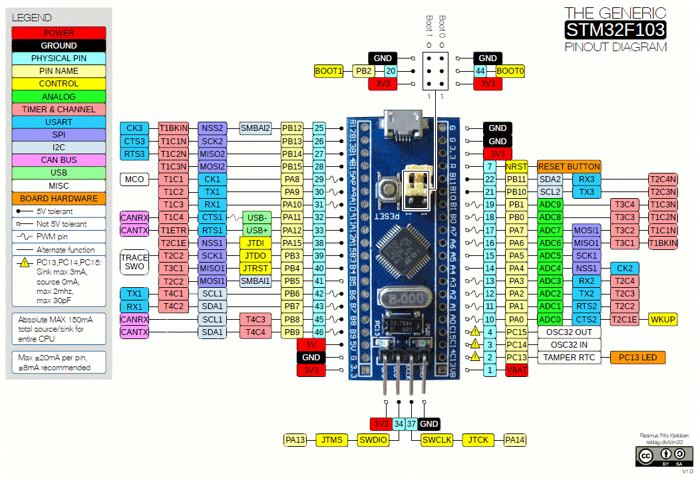

# TinyGo "Hello World" on STM32 Blue Pill

## Warning

Fedora ships `tinygo` without STM32 devices support according to [the build configuration](https://src.fedoraproject.org/rpms/tinygo/blob/rawhide/f/tinygo.spec#_229). It is suggested to [build the solution locally](https://tinygo.org/docs/guides/build/) and then install.

## STM32 "Blue Pill" Pin Diagram

## References

- [ST Micro STM32F103XX "Bluepill"](https://tinygo.org/docs/reference/microcontrollers/bluepill/)
- [Blinking LED](https://tinygo.org/docs/tutorials/blinky/)
